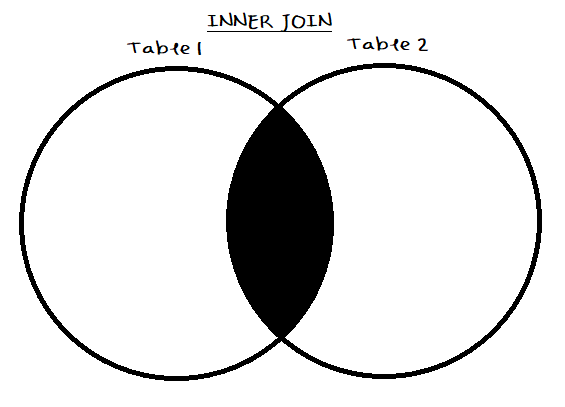
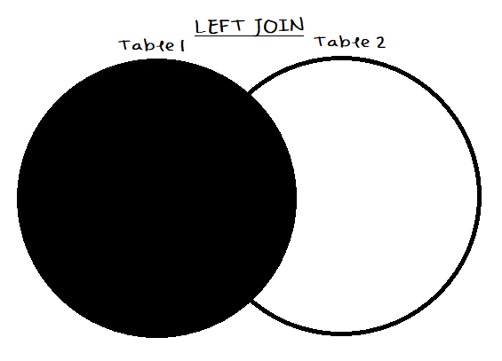
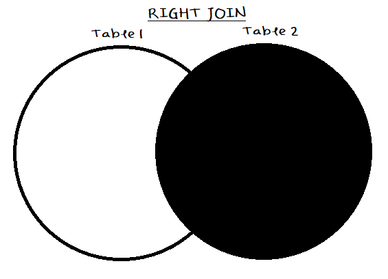

```{r setup, include=FALSE}
knitr::opts_chunk$set(echo = TRUE)
```

# SQLite Basics

## Basic Queries

### SELECT

Example: 

```SQL
SELECT columnName1, columnName2
FROM tableName
```
> Tip: `SELECT *` gives all columns

### WHERE

Example: 

```SQL
SELECT *
FROM tableName
WHERE columnName1 = "Chad"
```

Other useful operations (besides `=`) include: `!=`, `>=`, `<=`, etc.

The operator `=` is functionally equivalent to the use of the `IS` keyword, as in 
```SQL
WHERE columnName1 IS 2014
```

### AND/OR

Example: 

```SQL
SELECT *
FROM tableName
WHERE ( columnName1 IS 2014 OR 2015)
  AND columnName2 IS "Boris" 
```

Note that `AND` takes operator precedence over `OR`, so be sure to explicitly enclose `OR` expressions in parentheses if they are to be evaluated first.

### Misc. mathematical/utility functions

  - ROUND: `ROUND(Price, 1)` rounds `Price` to 1 digit past the decimal
    - In order to use floats, divide by 1.0
    - To round to the nearest 10, do `(10 * ROUND(value/10.0))`
  - ABS: `ABS(value)` takes the absolute value of `value`
  - MAX: `MAX(col1)` returns the maximum of the values in `col1`
  - MIN: `MIN(col1)` returns the minimum of the values in `col1`
  - AVG: `AVG(col1)` returns the average of all of the values in `col1`
  - SUM: `SUM(col1)` returns the sum of all the values in `col1`
  - TOTAL: `TOTAL(col1)` returns the sum of all the values in `col1`
    - The only difference between `SUM` and `TOTAL` is that when all of the rows passed to `SUM` are `NULL`, `SUM` returns `NULL`. When all of the rows in a column passed to `TOTAL` are `NULL`, `TOTAL` returns 0.
  - COUNT: `COUNT(column)` returns the number of entries in the column
  - GROUP_CONCAT: `GROUP_CONCAT(col1, sep)` returns the concatenation of all non-null values in `col1`, separated by `sep`. If no separator is provided, "," (comma) is used by default
  - UNION and UNION ALL: `A UNION ALL B` returns all records from both A and B including duplicates; `A UNION B` returns all records from A and B and removes duplicates
  
General example:

```SQL
SELECT MAX(tableName.col1)
FROM tableName
```

More general example:

**Input**

  A   B  
 --- --- 
  1   1  
  1   2  
  1   3  
  2   1  
  3   1  

**Output**

  A   SUM(B)   AVG(B)   MAX(B)   MIN(B)   GROUP_CONCAT(B)  
 --- -------- -------- -------- -------- ----------------- 
  1   6        2        3        1        1,2,3            
  2   1        1        1        1        1                
  3   1        1        1        1        1                

## String Manipulation

### LTRIM, RTRIM, and TRIM

#### LTRIM

Example:

```SQL
LTRIM(poverty.country, "ABCDEabcdefgh")
```

Input to and output from above query:

  input     output 
  -----     ------ 
  Canada    nada   
  Chad             
  Denmark   nmark  
  Cyprus    yprus  

`LTRIM` trims all characters from the **left** that match the specification given as the second argument, and stops when it reaches a character not present in the given matching list.

> Tip: avoid using two `LTRIM` statements with `OR`, like so: 

```SQL
LTRIM(data, "A" OR "B")
```

#### RTRIM

```SQL
RTRIM(poverty.country, "ABCDEabcdefgh")
```

Input to and output from above query:

  input     output 
  -----     ------ 
  Canada    Can   
  Chad             
  Denmark   Denmark  
  Cyprus    Cyprus  

`RTRIM` trims all characters from the **right** that match the specification given as the second argument, and stops when it reaches a character not present in the given matching list.

> Tip: in order to take "A" or "B" off of the back of a word, simply pass "AB" as the argument. If only one word ends in "AB", just use a `CASE WHEN` statement to handle it.

#### TRIM

The `TRIM` function removes characters from both ends of a string. 

Examples:

```SQL
TRIM("!HELLO#", "!#")

TRIM("00000000001230000000000", "0")

TRIM("131232323131231232312323h2uhu3h2313123123123123", "123")
```

The above examples return "Hello", "123", and "h2uhu3h" respectively.

When `TRIM` is not passed a second argument, it just strips whitespace from both ends of the string.

### SUBSTR

Example: 

```SQL
SUBSTR(columns, 2, 8)
```

  input                output    
 -------------------- ---------- 
  10 boxes x 20 bags   0 boxes   
  1 kg pkg.              kg pkg.   
  2 kg box              kg box   
  24 - 12 oz bottles   4 - 12 o  

This substring query **starts in space 2** and then **goes up to and includes space 9**. This is because the `SUBSTR` function has a **start** parameter and a **length** parameter, instead of the usual start and **end** parameters We see in other languages. We compare the SQL and Python string slicing below. Variables "a" and "b" are the same, and we slice an equal portion of the string "text" in each command:

```SQL
SUBSTR(text, a, b)
```

```python
x = text[a:a+b]
```

Another `SUBSTR` example:

```SQL
SUBSTR(columns, -2, 2)
```

  input                output    
 -------------------- ---------- 
  10 boxes x 20 bags   gs   
  1 kg pkg.             g.   
  2 kg box             ox   
  24 - 12 oz bottles   es  


### Misc. string functions

  - UPPER: `UPPER(column)` makes the entire column uppercase
  - LENGTH: `LENGTH(column)` returns the length of each entry
  - SUBSTR and LENGTH: `SUBSTR(columns, 1, LENGTH(columns)-1)` takes off the last letter of each word
  
**String concatenation** in SQLite takes the form of the **concatenate operator**, `  `. This is the same as the "or" operator in Java. 

Example:

```SQL
name1    name2  -- this returns "name1name2"
```

## CASE WHEN, AS 

Example:

```SQL
CASE WHEN SUBSTR(column, 1, 11) = "Afghanistan" THEN SUBSTR(column, 2, 10000)
WHEN SUBSTR(column, 1, 1) = "A" THEN SUBSTR(column, 1, length(column) - 1)
WHEN SUBSTR(column, 1, 2) = "B" THEN "Konkey Dong"
ELSE column END AS colnew
```

A `CASE WHEN` statement starts with `CASE WHEN`. Then, we check against some number of conditions with the above-demonstrated syntax; after each `WHEN` there is a logical expression whose validity we check. If this expression evaluates to false, we continue; otherwise, we go to the `THEN` portion and set our value to the value specified therein. 

The `END AS` portion tells the `CASE WHEN` statement that it is done (the `END` part), and that this column should be called "colnew" (the `AS` portion).

> Tip: we can also use `NULL` as a general `ELSE`, as nothing is equal to `NULL` for any comparison operator. 

A more common use of the `AS` keyword is in naming columns while selecting them, as in this example:

```SQL
SELECT coluumn1, newcol1, newcol2, newcol3
FROM (
  SELECT *,
    column1 AS newcol1, 
    ROUND(column1, 2) AS newcol2,
    MAX(column1) * 7 - 1 AS newcol3, 
  FROM tablename
  WHERE 
    year IS 2014 AND
    column1 IS NOT NULL
)
```

> Tip: remember to include the commas! They are a huge fucking pain in the ass to troubleshoot.


## Using the Text Editor

The text editor differs from a view in that it can be used to edit data sets, by inserting and deleting values (and columns -- see "Updating/Altering Data" below). 

Examples:

```SQL
INSERT INTO database(country, poverty_190)
VALUES("Stan", 69)
```

```SQL
DELETE FROM database
WHERE country = "Stan" OR country = "Stan2"
```

## ORDER BY

Examples of single-column `ORDER BY`s:

```SQL
SELECT UnitPrice, ProductName
FROM UnitPrice
ORDER BY UnitPrice DESC
```

> Tip: use `DESC` to order from "greatest" to "lowest" (or in reverse alphabetical order for strings); use `ASC` to do the opposite.

```SQL
SELECT UnitPrice, ProductName, UnitPrice * ProductName
FROM Products
ORDER BY UnitsInStock * UnitPrice DESC
```

> Tip: instead of using the name of the column, we can also use the index of the column in the table. For instance, if UnitsInStock was the 5th column, we could have instead written `...ORDER BY 5 * UnitPrice DESC`.

```SQL
SELECT ProductsA, UnitPrice, ProductsA * UnitPrice AS InValue
FROM Products
ORDER BY InValue DESC
```

Example of bi-column `ORDER BY`:

```SQL
SELECT ProductA, ProductB
FROM Products
ORDER BY 2 ASC, 1 DESC
```

The above query first sorts ascending by ProductB, and then sorts descending by ProductA. With multiple column `ORDER BY`s, the secondary (tertiary, quaternary, etc.) sorting is done **within the previously sorted blocks**. An example would be tedious to concoct and is thus omitted. 

## GROUP BY

The SQLite `GROUP BY` command aggregates records by a given column and returns the results of the aggregation. Aggregation can mean any of the following:

  - Adds the records
  - Averages the records
  - Shows the max of the columns
  - etc.
  
An example of a `GROUP BY` sum follows:

**Before**

  col1   col2  
 ------ ------ 
  1      7     
  1      8     
  3      9     
  3      4     
  3      8     
  6      3     

**After**

  col1   col2  
 ------ ------ 
  1      15    
  3      21    
  6      3     

Another example:

```SQL
SELECT 
  country,
  n_poverty_190,
  n_poverty_320,
  n_poverty_550,
  SUM(n_poverty_190, n_poverty_320, n_poverty_550) AS p5
FROM poverty
WHERE n_poverty_190 IS NOT NULL
GROUP BY country
ORDER BY ps DESC
```

The `SUM` function above creates "ps", where countries' poverties over all years and categories are summed and grouped.

The `SUM` function could be replaced by any of `COUNT`, `AVG`, `MAX`, `MIN`, or `GROUP_CONCAT`, to form a different valid query. 

Similarly to `ORDER BY`, `GROUP BY` can be used on multiple columns. 

Multi-column example:

```SQL
SELECT 
  cat1, 
  cat2,
  SUM(cat1) AS sum1,
  SUM(cat2) AS sum2
FROM table
GROUP BY cat1, cat2
HAVING SUM(cat1) > 5
```

The `HAVING` keyword in the above query is the `GROUP BY` analogue of the `WHERE` keyword.

## Updating/Altering Data

As previously mentioned in the Text Editor section, we cannot edit data in views -- only in the SQL Query Editor. 

### Creating a table

Example table creation:

```SQL
CREATE TABLE TableName (
  ProductID INTEGER PRIMARY KEY,
  Column1 VARCHAR(25),
  Cost NUMBER(6,2)
)
```

Let's unpack the functions each of the keywords in the above example have:

  - `CREATE TABLE`: creates the table TableName (obviously)
  - `INTEGER`: tells SQLite that ProductID is of type Integer
  - `PRIMARY KEY`: designates ProductID as the primary key of table "TableName"
  - `VARCHAR`: tells SQLite that Column1 is a string of max length 25
  - `NUMBER`: tells SQLite that Cost can contain numbers of 6 digits max, 2 of which can be after the decimal point

### Updating a table

Example table updating (row adding):

```SQL
INSERT INTO poverty
  SELECT 
    columnName    "E",       -- appends "E" to columnName
    "Epified"    country,   -- prepends "E" to country
    n_poverty_190 + 100,    -- adds 100 to n_poverty_190
    n_poverty_320 + 101,
    n_poverty_550 + 17,
    population
  FROM poverty
```

The above example creates the new observations columnName    "E", "Epified"    country, etc. and adds them to the poverty database.

Example table updating (altering):

```
UPDATE poverty SET 
  columnName = "Barkachistan"
WHERE n_poverty_190 > 0.3
```

The above example sets the values of columnName to "Barkachistan" if n_poverty_190 is above 0.3.

> Tip: if you want to create a table with a name that is a keyword, you need to escape it with either brackets (`[keyword]`) or quotes (`"keyword"`). SQLite documentation recommends the use of quotes over brackets, since quotes are standard SQL.

## Aggregates

Example creation of a "counter":

```SQL
SELECT COUNT(colName)
FROM tableName
AS counter
```

Note that `GROUP BY` for two categories demarcates breakdown like so:

  1     2    
 ----- ----- 
  c1a   c2a  
  c1a   c2b  
  c1b   c2a  
  c1b   c2b  

This groups by both categories. Note that grouping by every column is like no grouping at all.

> Tip: `MIN(text_field)` selects text that would appear first if the column were ordered by `ASC` (ascending alphabetically).


# Joins


## Types of Joins

There are four main types of joins: Inner Joins, Left Joins, Right Join, and Full Outer Joins. Venn Diagrams follow for each.

### Inner Joins

Diagram:



Example Left Join:

**Table 1**

  men     ID  
 ------- ---- 
  Boris   1   
  Borg    2   
  Biq     3   
  Gries   4   

**Table 2**

  ID   Dept  
 ---- ------ 
  1    GOVT  
  2    ORIE  
  3    ORIE  
  5    CS    
  6    AEP   

**Result of `T1 INNER JOIN T2 ON T1.ID = T2.ID`**

  men   	  ID 	  Dept 	 
 -------	 ----	 ------	 
  Boris 	  1  	  GOVT 	 
  Borg  	  2  	  ORIE 	 
  Biq   	  3  	  ORIE 	 

### Left Joins

Diagram: 



Example Left Join:

**Table 1**

  men     ID  
 ------- ---- 
  Boris   1   
  Borg    2   
  Biq     3   
  Gries   4   

**Table 2**

  ID   Dept  
 ---- ------ 
  1    GOVT  
  2    ORIE  
  3    ORIE  
  5    CS    
  6    AEP   

**Result of `T1 LEFT JOIN T2 ON T1.ID = T2.ID`**

  men   	  ID 	  Dept 	 
 -------	 ----	 ------	 
  Boris 	  1  	  GOVT 	 
  Borg  	  2  	  ORIE 	 
  Biq   	  3  	  ORIE 	 
  Gries 	  4  	  NULL 	 


### Right Joins

**NOTE: Right Joins are NOT SUPPORTED on SQLite 3. Instead, use `FROM T2 LEFT JOIN T1`**.

Diagram:



Example Left Join:

**Table 1**

  men     ID  
 ------- ---- 
  Boris   1   
  Borg    2   
  Biq     3   
  Gries   4   

**Table 2**

  ID   Dept  
 ---- ------ 
  1    GOVT  
  2    ORIE  
  3    ORIE  
  5    CS    
  6    AEP   


**Result of `T1 RIGHT JOIN T2 ON T1.ID = T2.ID` or `T2 LEFT JOIN T1 ON T1.ID = T2.ID`**

  men   	  ID 	  Dept 	 
 -------	 ----	 ------	 
  Boris 	  1  	  GOVT 	 
  Borg  	  2  	  ORIE 	 
  Biq   	  3  	  ORIE 	 
  NULL  	  5  	  CS   	 
  NULL  	  6  	  AEP  	 

### Full Outer Joins

Diagram:


Example Left Join:

**Table 1**

  men     ID  
 ------- ---- 
  Boris   1   
  Borg    2   
  Biq     3   
  Gries   4   

**Table 2**

  ID   Dept  
 ---- ------ 
  1    GOVT  
  2    ORIE  
  3    ORIE  
  5    CS    
  6    AEP   

**Result of `T1 FULL OUTER JOIN T2 ON T1.ID = T2.ID`**

  men   	  ID 	  Dept 	 
 -------	 ----	 ------	 
  Boris 	  1  	  GOVT 	 
  Borg  	  2  	  ORIE 	 
  Biq   	  3  	  ORIE 	 
  Gries 	  4  	  NULL 	 
  NULL  	  5  	  CS   	 
  NULL  	  6  	  AEP  	 

## Join Syntax

### Syntax for Inner and Left Joins

Example:

```SQL
SELCT field1, field2
FROM TableA INNER JOIN TableB
ON TableASharedColumn = TableBSharedColumn
```

This would return **only the records where this is the case** (that is, in this example, TableASharedColumn is equal to TableBSharedColumn). This differs from `LEFT JOIN` in that `LEFT JOIN` would return **all records from TableA and the records from TableB where this is the case**. That is, a `LEFT JOIN` will always return all of the records from the left argument, and will combine those with the records of TableB if there is a match. If there is not a match, `NULL` is returned. 

### Syntax for Full Outer Joins

Example:

```SQL
SELECT field1, field2
FROM TableA LEFT JOIN TableB 
ON TableASharedColumn = TableBSharedColumn
UNION ALL 
SELECT field1, field2
FROM TableB LEFT JOIN TableA
ON TableBSharedColumn = TableASharedColumn
WHERE TableASharedColumn IS NULL
```

## Multi-table Joins

Example of a Multi-Table join:

```SQL
SELECT T1.ID, T1.a, T2.b, T3.c
FROM T1 INNER JOIN T2
ON T1.ID = T2.ID
  INNER JOIN T3
  ON T1.ID = T3.ID
```

This query is functionally equivalent to the following:

```SQL
...
FROM T1, T2, T3
WHERE T1.ID = T2.ID AND T1.ID = T3.ID
```

## Self-joins

Objective: Create a new table comparing values from a single table.

Example: Comparing netIDs against each other to return the results each have in common (say, the classes students have in common)

**Input table**

  netID 	  class     	 
 -------	 -----------	 
  brg54 	  ORIE 3120 	 
  brg54 	  ORIE 3510 	 
  brg54 	  GOVT 3253 	 
  bar94 	  MATH 3110 	 
  bar94 	  ORIE 3120 	 
  bar94 	  ORIE 3510 	 
  zdk8  	  LGBT 6969 	 
  zdk8  	  AEP 4200  	 
  zdk8  	  ORIE 3510 	 

**Output table**

  netID1 	  netID2 	  class     	 
 --------	 --------	 -----------	 
  brg54  	  bar94  	  ORIE 3120 	 
  brg54  	  bar94  	  ORIE 3510 	 
  brg54  	  zdk8   	  ORIE 3510 	 
  bar94  	  zdk8   	  ORIE 3510 	 
  
The query that produces the above results is as follows:

```SQL
SELECT 
  Table1.netID AS netID1, 
  Table2.netID AS netID2, 
  Table1.class AS class
FROM Table AS Table1 INNER JOIN Table AS Table2   -- inner joins Table with itself
ON Table1.netID < Table2.netID                    -- removes "duplicates" (reversed-order ones)
AND Table1.netID = Table2.netID                   -- where records are the same
```

To instead *rank* students, one might name the above Table2 "HigherNetID" (because it is greater) and in another view, add `COUNT(HigherNetID) AS Ranking` (because it counts all of the higher netIDs), and then `ORDER BY Ranking ASC` (to order the netIDs in ranking order).

## Misc. join-related functions

  - LIMIT: `LIMIT n` limits the query to $n$ results
  - CAST: `CAST(value AS float)` turns value into type `float`

# Keys and Schema

## Primary and Foreign Keys

A key is **referenced** in a **parent** table and **is referenced by** an element of a **child** table. 

A **primary key** is the one that **gets referenced**; a **foreign key** is the one that is doing the **referencing**. 

Example:

**Table1**

  Table1           	 
 ------------------	 
  **customerID**       	 
  customerName     	 
  customerMajor    	 
  customerDickSize 	 

**Table2**

  Table2      	 
 -------------	 
  **orderID**  	 
  customerID  	 
  orderGirth  	 
  orderColor  	 
  myDongLongA 	 
  babyA       	 

In this table:

  - **Table1.customerID and orderID are primary keys** (unique identifier, never `NULL`) 
  - **Table2.customerID is a foreign key** (in one table, *references* another field)
    - **Table2.customerID *references* Table1.customerID**
      - Table2 is the child, Table2.customerID is the foreign key
      - Table1 is the parent, Table1.customerID is the primary key
      
### Ones and Infinities, and Bolding

We use a **1** to refer to a **primary key** and $\infty$ to refer to a **foreign key**.

A primary key will always be unique in its own table; in other words, there will be only **1** of each. But each child table of a parent table can have $\infty$ occurrences of any of the primary keys within it. 

For instance, there could be a table called "coaches" with columns "name" and "coachID", with primary key "coachID", and a table called "students" with columns "name" and "coachID", with foreign key "coachID". There could be infinite students, and each coachID could be referenced infinite ($\infty$) times from the "students" table; but each coach can only have one name, so there can only be **1** of each coachID in the "coaches" table.

In the above example, with Table1 and Table2, we could draw a line from customerID in Table1 to customerID in Table2, with a **1** on the Table1 side and an $\infty$ on the Table2 side.

Typically we **bold** (or underline) the primary key of a column when we write it out. This can be seen above in Table1 and Table2.

## Referential Integrity

For a value to be **inserted** into the child table, a value in the parent must exist. In the above example with Table1 and Table2, for instance, we know that there must be a customerID in Table1 for every customerID in Table2. 

For a value to be **removed** from the parent table, corresponding values must be removed from the child table. In the above example, for instance, to remove a customerID in Table1, all rows sharing that customerID must be removed from Table2 as well. 

## Schema Design

Main ideas in Schema Design:

  - **Avoid data duplication** (keys excluded)
  - The **1** end of a relationship typically belongs to a primary key but can also simply signify a 1-1 relationship between tables.
  - Pay attention to the relevance of **1**s and $\infty$s. See [here](https://hentai.foundation/ORIE3120/PrelimReview1/index.html#ones-and-infinities-and-bolding) for more details.


